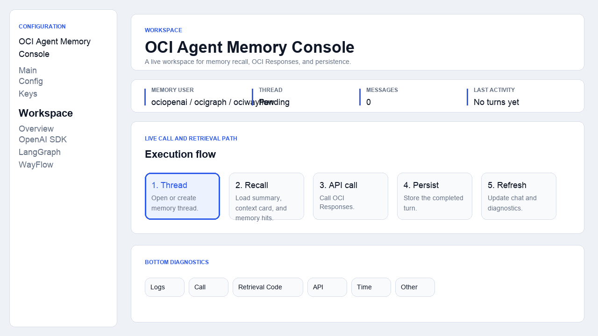
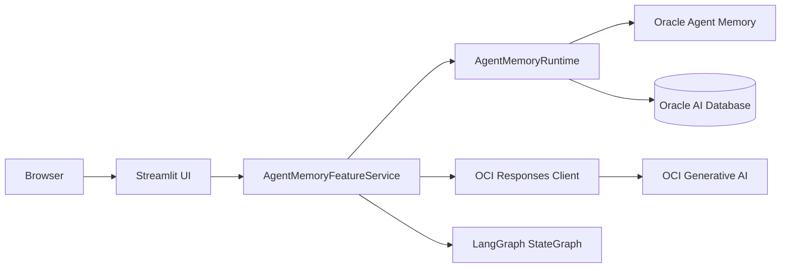

# OCI Agent Memory Demo

An enterprise-ready Streamlit demo for Oracle Agent Memory with OCI Generative AI. The app shows two ways to build the same memory-backed assistant:

- **OpenAI SDK path**: direct OCI Responses calls through the OpenAI-compatible SDK.
- **LangGraph path**: explicit `StateGraph` orchestration using the same Oracle Agent Memory backend.

The app is intentionally built as an operations console. It shows the chat, live execution flow, retrieved memory, backend logs, API metadata, and the actual retrieval-code path used during each turn.

## Walkthrough



Video version: [agent-memory-ui-flow.mp4](design-documents/video/agent-memory-ui-flow.mp4)

## What This Demo Shows

- Live Oracle Agent Memory integration through the `oracleagentmemory` Python package.
- OCI Generative AI Responses API usage through the OpenAI Python SDK.
- A direct SDK workspace with memory retrieval, model generation, and persistence.
- A LangGraph workspace with explicit recall, draft, and persist nodes.
- Per-framework memory users:
  - OpenAI SDK: `ociopenai`
  - LangGraph: `ocigraph`
- Bottom diagnostics tabs for logs, call progress, retrieval code, API metadata, time, summary, and context card.
- Terraform-assisted OCI setup for Generative AI project/API key and Autonomous Database.

## Architecture



Core flow:

1. The user sends a prompt from the Streamlit workspace.
2. The app opens or creates an Oracle Agent Memory thread.
3. The service reads summary, context card, and relevant memory hits.
4. OCI Responses generates the assistant answer using the memory context.
5. The completed user and assistant turn is persisted back to Oracle Agent Memory.
6. The UI refreshes chat, flow, logs, retrieved memory, summary, and context card.

## Repository Layout

```text
app/
  config.py                  # Environment and OCI profile resolution
  main.py                    # Legacy FastAPI shell kept for compatibility
  templates/
  static/
design-documents/
  architecture-design.md
  ui-flow-design.md
  memory-retrieval-flow.md
  video-narration-script.md
  video/
features/
  agent_memory/
    infra/terraform/         # OCI project, API key, ADB, wallet, network setup
    scripts/                 # OCI CLI wrapper scripts used by Terraform
    service.py               # Live memory, Responses, and LangGraph runtime
    README.md
streamlit_app.py             # Primary local app entrypoint
bash.sh                      # Setup/provision/start wrapper
```

## Quick Start

Prerequisites:

- Python 3.10 to 3.13.
- OCI CLI configured with a profile that can create Generative AI and Autonomous Database resources.
- Terraform installed.
- Access to an OCI compartment.

Clone and install:

```bash
git clone https://github.com/RahulMR42/oci_agentmemory_demo.git
cd oci_agentmemory_demo
python -m venv .venv
source .venv/bin/activate
pip install -e .
```

Create local environment file:

```bash
cp .env.example .env
```

For a live run, either provision OCI resources with the wrapper:

```bash
export TF_VAR_compartment_ocid=ocid1.compartment.oc1..replaceMe
./bash.sh up
```

Or start with an already populated `.env`:

```bash
./bash.sh start
```

The app prints a generated local demo password if `APP_DEMO_PASSWORD` is blank. Open the Streamlit URL, usually:

```text
http://localhost:8501
```

## Reuse Procedure

Use this repo as a starter for a new enterprise AI demo:

1. Copy or fork the repository.
2. Keep feature code isolated under `features/<feature_name>/`.
3. Add new framework/runtime logic in a feature service module instead of placing backend code inside the Streamlit UI.
4. Use a state object similar to `DemoState` as the contract between backend execution and UI rendering.
5. Keep secrets in `.env` only. Do not commit `.env`, Terraform state, generated wallets, generated API-key files, or local virtual environments.
6. Add any new OCI infrastructure under `features/<feature_name>/infra/terraform/`.
7. Add feature-specific setup scripts under `features/<feature_name>/scripts/`.
8. Document the new feature in `features/<feature_name>/README.md` and add architecture notes under `design-documents/`.
9. Run `python -m py_compile streamlit_app.py features/<feature_name>/*.py` before publishing.
10. Run a secret scan before pushing.

For a new memory-backed agent, the main reuse points are:

- `AgentMemoryRuntime.search()` for scoped retrieval.
- `AgentMemoryRuntime.snapshot()` for summary, context card, and memory hits.
- `LiveOracleAgentMemoryService.process_turn()` for framework routing.
- `_run_openai_sdk_turn()` for direct model calls.
- `_get_langgraph_app()` for explicit graph orchestration.

## Memory Retrieval Code Path

The actual retrieval happens in `features/agent_memory/service.py`:

```python
results = self._memory.search(
    query=normalized_query,
    scope=self._search_scope_cls(user_id=user_id),
)
```

That call is wrapped by `snapshot()`:

```python
def snapshot(self, *, thread: object, user_id: str, query: str) -> ThreadSnapshot:
    return ThreadSnapshot(
        thread=thread,
        summary=self.read_summary(thread),
        context_card=self.read_context_card(thread),
        memory_hits=self.search(query=query, user_id=user_id),
    )
```

The UI also exposes this path in the bottom **Retrieval Code** tab so reviewers can see where memory retrieval happens while the app is running.

## Configuration

Important environment values:

```bash
APP_DEMO_USERNAME=oci
APP_DEMO_PASSWORD=
AGENT_MEMORY_MODE=live
AGENT_MEMORY_SCHEMA_POLICY=create_if_necessary

OCI_GENAI_REGION=us-chicago-1
OCI_GENAI_PROJECT_OCID=
OCI_GENAI_API_KEY=
OCI_GENAI_CHAT_MODEL=openai.gpt-oss-120b

AGENT_MEMORY_DB_USER=
AGENT_MEMORY_DB_PASSWORD=
AGENT_MEMORY_DB_DSN=
AGENT_MEMORY_WALLET_DIR=
AGENT_MEMORY_WALLET_PASSWORD=
AGENT_MEMORY_LLM_MODEL=oci/cohere.command-latest
AGENT_MEMORY_EMBEDDING_MODEL=oci/cohere.embed-v4.0
```

Never commit real values for these fields. `.env`, Terraform state, local `terraform.tfvars`, generated API-key files, and generated wallet files are ignored.

## Terraform Provisioning

The feature Terraform stack can create:

- OCI Generative AI project.
- OCI Generative AI API key through OCI CLI wrapper scripts.
- Autonomous Database for Oracle Agent Memory.
- Wallet artifacts for local DB connectivity.
- Supporting VCN, subnet, route table, internet gateway, and NSG resources.
- Optional IAM policy for API-key based runtime access.

Provision:

```bash
export TF_VAR_compartment_ocid=ocid1.compartment.oc1..replaceMe
./bash.sh provision
```

Provision and start:

```bash
./bash.sh up
```

Destroy Terraform-managed infrastructure:

```bash
terraform -chdir=features/agent_memory/infra/terraform destroy
```

Note: generated OCI Generative AI project/API-key cleanup may need explicit OCI-side handling because those are created by wrapper scripts.

## Design Documents

- [Architecture Design](design-documents/architecture-design.md)
- [UI Flow Design](design-documents/ui-flow-design.md)
- [Memory Retrieval Flow](design-documents/memory-retrieval-flow.md)
- [Video Narration Script](design-documents/video-narration-script.md)
- [Browser Walkthrough HTML](design-documents/feature-walkthrough.html)

## Regenerate Walkthrough Media

Install dependencies:

```bash
pip install -e .
```

Generate GIF and MP4:

```bash
python design-documents/video/generate_walkthrough_gif.py
```

Outputs:

- `design-documents/video/agent-memory-ui-flow.gif`
- `design-documents/video/agent-memory-ui-flow.mp4`

## Security Notes

- Do not commit `.env`.
- Do not commit `.venv/`, `*.egg-info/`, `__pycache__/`, `build/`, or `dist/`.
- Do not commit Terraform state, local `terraform.tfvars`, generated API-key JSON, generated API-key value files, generated wallets, or wallet zips.
- Keep OCI credentials in OCI CLI config or environment variables outside the repository.
- Review `features/agent_memory/infra/terraform/generated/` before sharing local work; it is intentionally ignored.

## References

- Oracle Agent Memory docs: <https://docs.oracle.com/en/database/oracle/agent-memory/26.4/agmea/index.html>
- OCI Responses API: <https://docs.oracle.com/en-us/iaas/Content/generative-ai/responses-api.htm>
- OCI Generative AI API keys: <https://docs.oracle.com/en-us/iaas/Content/generative-ai/api-keys.htm>
- OCI Generative AI projects: <https://docs.oracle.com/en-us/iaas/Content/generative-ai/projects.htm>
- LangGraph reference: <https://reference.langchain.com/python/langgraph/>
