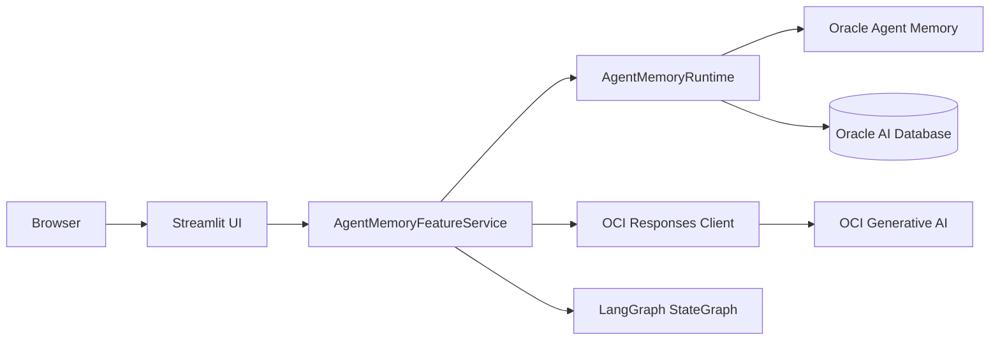
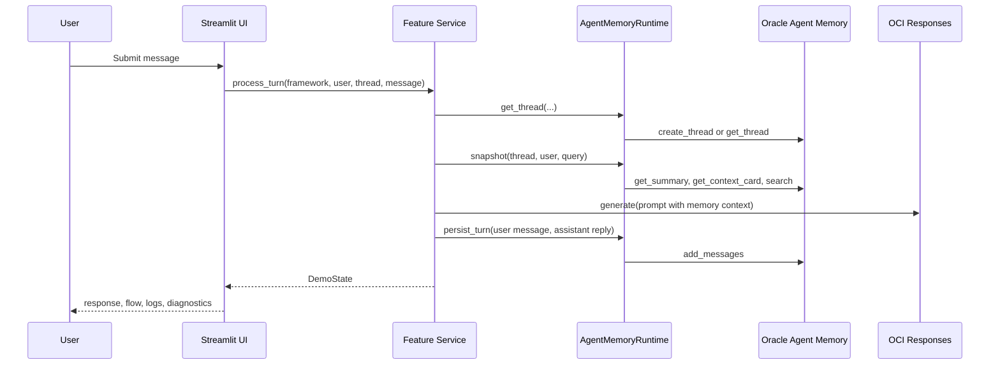

# OCI Agent Memory Demo Architecture Design

## Purpose

The application demonstrates an enterprise assistant backed by Oracle Agent Memory and OCI Generative AI. It lets a user compare two execution styles against the same live memory backend: a direct OpenAI SDK path and a LangGraph orchestration path. The UI is designed as an operational console, not a marketing page, so the main workflow stays focused while implementation details remain available in bottom diagnostics tabs.

## Runtime Components

The Streamlit UI in `streamlit_app.py` owns session state, navigation, form submission, and rendering. It does not call OCI directly. All backend behavior goes through `features/agent_memory/service.py`, which separates the live runtime from unavailable setup states.

## Feature Boundaries

The app keeps the demo feature isolated under `features/agent_memory/`. The service layer contains framework definitions, runtime adapters, turn processing, memory rendering, backend status, and LangGraph construction. Terraform and setup scripts remain under `features/agent_memory/infra/terraform/` and `features/agent_memory/scripts/`.

The old FastAPI templates still exist in the repository, but the primary local entrypoint is `streamlit_app.py`, as documented in `README.md`.

## Live Turn Data Flow

## Direct OpenAI SDK Path

The OpenAI SDK workspace uses the shortest path. It opens or creates a thread, retrieves memory context, builds a grounded prompt, calls OCI Responses through the OpenAI-compatible SDK, persists the completed turn, and returns a `DemoState` to the UI.

This path is best for explaining the minimum production integration: retrieve memory, call the model, persist the result.

## LangGraph Path

The LangGraph workspace uses the same live runtime but expresses the turn as graph nodes:

- `recall_context`
- `draft_response`
- `persist_turn`

This path is best for explaining orchestration, explicit state transitions, and how memory retrieval can become a named graph step.

## State Model

`DemoState` is the UI contract. It contains the framework label, thread id, user id, agent id, messages, search results, progress steps, backend logs, notes, summary, context card, and latest assistant draft. Keeping this state object explicit lets the UI show chat, live flow, metrics, and diagnostics without coupling to Oracle SDK objects.

## Error Handling

Backend availability is exposed through `BackendStatus`. Missing OCI or database settings produce a setup-blocked UI instead of a simulated backend. Turn execution errors are captured into the framework-specific session error key and displayed near the composer.

## Operational Notes

The UI intentionally exposes non-secret identifiers such as project OCID and DB DSN in the sidebar for demo validation. Secrets such as passwords and API keys are not displayed. The OpenAI SDK workspace defaults to memory user `ociopenai`, while the LangGraph workspace defaults to `ocigraph`, making the two memory scopes easy to distinguish during a demo.
