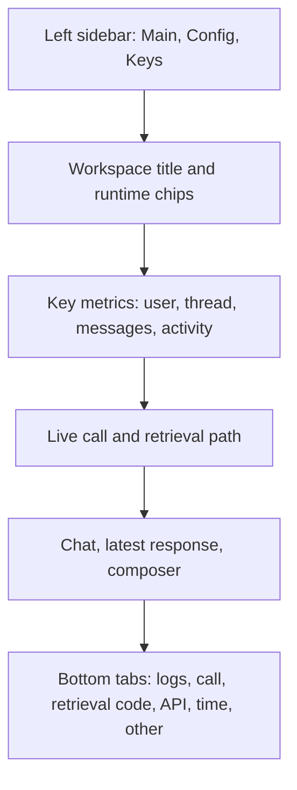

# UI Flow Design

## Design Goal

The UI is an operations console for demonstrating how an enterprise assistant uses Oracle Agent Memory. The main workspace should fit the browser, keep the current turn visible, and make technical details available without overwhelming the demo flow.

## Layout

## Left Sidebar

The sidebar holds configuration and navigation:

- Main: page selection, runtime status, reset controls, logout.
- Config: theme, per-framework memory users, model, and region.
- Keys: non-secret identifiers and documentation links.

This keeps the main canvas focused on the active demo.

## Main Workspace

The workspace header identifies the current path: Overview, OpenAI SDK, LangGraph, or WayFlow. Runtime chips show whether the live backend is ready, which execution model is selected, and which memory user is active.

The metrics bar shows the current memory user, thread id, message count, and last activity. The OpenAI SDK workspace defaults to `ociopenai`, LangGraph defaults to `ocigraph`, and WayFlow defaults to `ociwayflow`. These values help the presenter explain which memory scope is active.

## Live Flow View

The live flow view shows five stages. For OpenAI SDK, the stages are thread, retrieval, API call, persist, and refresh. For LangGraph, the stages are thread, recall node, draft node, persist node, and refresh. For WayFlow, the stages are thread, memory recall, WayFlow agent, persist, and refresh. After a live turn, the flow uses backend progress entries to show what happened.

## Conversation Area

The conversation area is split into chat history and a right-side response/composer panel. The chat history shows the durable conversation record. The response panel shows the latest answer and lets the presenter send the next prompt.

## Bottom Diagnostics Tabs

The bottom diagnostics area keeps deeper technical detail available without occupying the primary workflow:

- Logs: backend trace messages.
- Call: progress steps and retrieved memory results.
- Retrieval Code: focused code snippets showing where memory retrieval happens.
- API: framework, model, region, agent id, and thread id.
- Time: last activity, visible message count, progress count.
- Other: notes, summary, and context card.

## Demo Flow

1. Open the app and sign in with the local demo credentials.
2. Confirm that OpenAI SDK uses `ociopenai`, LangGraph uses `ocigraph`, and WayFlow uses `ociwayflow` in the left sidebar.
3. Open the OpenAI SDK workspace.
4. Send a prompt that benefits from recall.
5. Show the live flow and bottom `Call` tab.
6. Open `Retrieval Code` to explain the exact memory retrieval call.
7. Switch to LangGraph and run a similar prompt.
8. Switch to WayFlow and run a similar prompt.
9. Compare the flow labels and logs.

## Design Constraints

The UI remains in Streamlit because the current app is Python-first and the request does not require custom client-side state management. A React or Vue shell would make sense if the app needed drag interactions, rich timelines, editable graph nodes, or persistent multi-pane layouts beyond Streamlit's component model.
